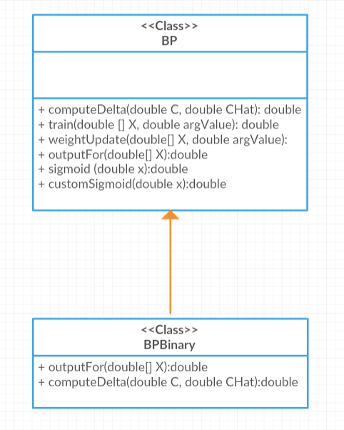
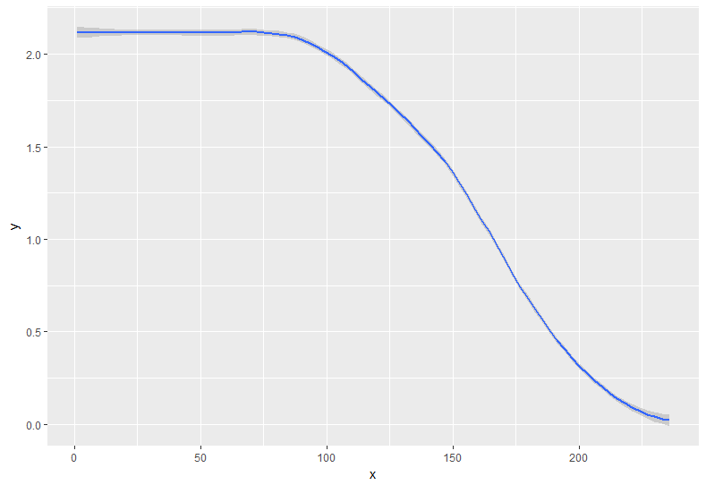
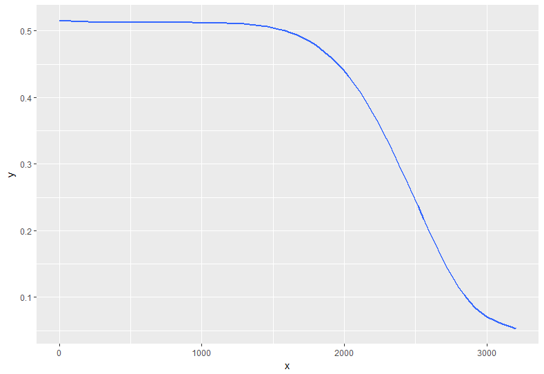

BackPropagation with two implementations: bipolar case and binary case.

A review of the implemented classes:
1. Class BP: it is an implementation of BackPropagation algorithm with bipolar case.  
2. Class BPBinary: the implementation of Backpropagation algorithm with binary case. 
                 Child class BPBinary extends parent class BP and overrides the outputFor and computeDelta function so as to use the 
                 customSigmoid function in outputFor and use a different delta.
  

3. Class TestBPBipolar: test class to train and test the BackPropagation algorithm with bipolar case. 
                 By running TestBPBipolar, the following result is expected:
                   a). On average it takes around 300 epochs to reach a total error of less than 0.05. 
                   b). Of 35 trials, 4 were observed not to converge and were discarded. 
                   c). Of the remaining 31 the average was 300, the min was 238 and the max was 716. 
                   
4. Class TestBPBinary: test class to train and test the BackPropagation algorithm with binary case.
                 By running TestBPBinary, the following result is expected:
                   a). On average it takes around 4000 epochs to reach a total error of less than 0.05. Of 35 trials. 
                   b). Of 35 trials, 5 were observed not to converge and were discarded.   
                   c). Of the remaining 30 the average was 4000, the min was 2536 and the max was 6788. 
                   
                 
                

